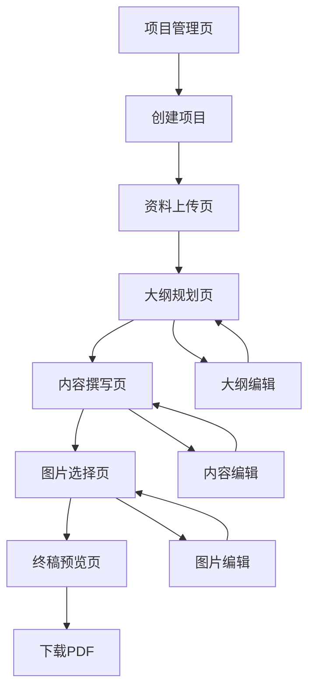

## 1. Product Overview
标书生成系统前端是一个直观、高效的工作台，帮助用户完成从需求分析到最终成稿的完整标书生成流程。
- 主要功能包括需求解析、大纲规划、内容撰写、质量审查和图片选择，为用户提供端到端的标书生成体验。
- 目标用户为企业投标团队和标书撰写人员，提高标书制作效率和质量。

## 2. Core Features

### 2.1 User Roles
| Role | Registration Method | Core Permissions |
|------|---------------------|------------------|
| 普通用户 | 无需注册 | 可使用所有标书生成功能 |

### 2.2 Feature Module
1. **项目管理页**：项目列表、创建项目、项目详情
2. **资料上传页**：文件上传、文件管理、文件分析
3. **大纲规划页**：章节大纲生成、用户确认、大纲编辑
4. **内容撰写页**：章节内容生成、内容编辑、质量审查
5. **图片选择页**：图片建议、图片选择、图片插入
6. **终稿预览页**：HTML预览、PDF下载、终稿分享

### 2.3 Page Details
| Page Name | Module Name | Feature description |
|-----------|-------------|---------------------|
| 项目管理页 | 项目列表 | 展示所有项目，支持项目搜索和过滤 |
| 项目管理页 | 创建项目 | 输入项目名称和描述，创建新项目 |
| 资料上传页 | 文件上传 | 支持拖拽上传和文件选择，支持多种文件类型 |
| 资料上传页 | 文件管理 | 显示已上传文件，支持文件删除和重新上传 |
| 大纲规划页 | 大纲生成 | 基于上传文件自动生成章节大纲 |
| 大纲规划页 | 大纲确认 | 用户确认大纲结构，可修改或删除章节 |
| 内容撰写页 | 内容生成 | 基于大纲自动生成各章节内容 |
| 内容撰写页 | 质量审查 | 自动检查内容质量，提供修改建议 |
| 图片选择页 | 图片建议 | 基于内容自动推荐合适的图片 |
| 图片选择页 | 图片插入 | 用户选择图片并确认插入位置 |
| 终稿预览页 | HTML预览 | 预览最终生成的HTML标书 |
| 终稿预览页 | PDF下载 | 下载PDF格式的最终标书 |

## 3. Core Process
用户从项目管理页开始，创建新项目后进入资料上传页上传招标文件和相关资料。系统分析资料后生成章节大纲，用户在大纲规划页确认大纲结构。确认后进入内容撰写页，系统自动生成各章节内容并进行质量审查。接着进入图片选择页，系统推荐图片，用户选择并确认插入位置。最后在终稿预览页预览和下载最终标书。

## 4. User Interface Design
### 4.1 Design Style
- 主色调：#2563eb（蓝色）、#f8fafc（浅灰背景）
- 辅助色：#3b82f6（亮蓝色）、#60a5fa（浅蓝色）
- 按钮样式：圆角矩形，悬停效果
- 字体：Inter，标题18-24px，正文14-16px
- 布局风格：卡片式布局，顶部导航，左侧功能导航
- 图标风格：线性图标，简洁现代

### 4.2 Page Design Overview
| Page Name | Module Name | UI Elements |
|-----------|-------------|-------------|
| 项目管理页 | 项目列表 | 卡片式项目卡片，包含项目名称、创建时间、状态等信息，悬停效果 |
| 资料上传页 | 文件上传 | 拖拽区域，文件列表，进度条，上传按钮 |
| 大纲规划页 | 大纲生成 | 树状大纲结构，编辑按钮，确认按钮，拖拽排序 |
| 内容撰写页 | 内容生成 | 富文本编辑器，章节导航，审查建议面板 |
| 图片选择页 | 图片建议 | 图片网格，选择按钮，预览功能 |
| 终稿预览页 | HTML预览 | 预览窗口，下载按钮，分享按钮 |

### 4.3 Responsiveness
- 桌面优先设计，支持响应式布局
- 平板设备：调整为双列布局
- 移动设备：调整为单列布局，导航改为汉堡菜单
- 触摸优化：增大按钮和可点击区域，支持触摸手势

### 4.4 3D Scene Guidance
- 无3D场景需求