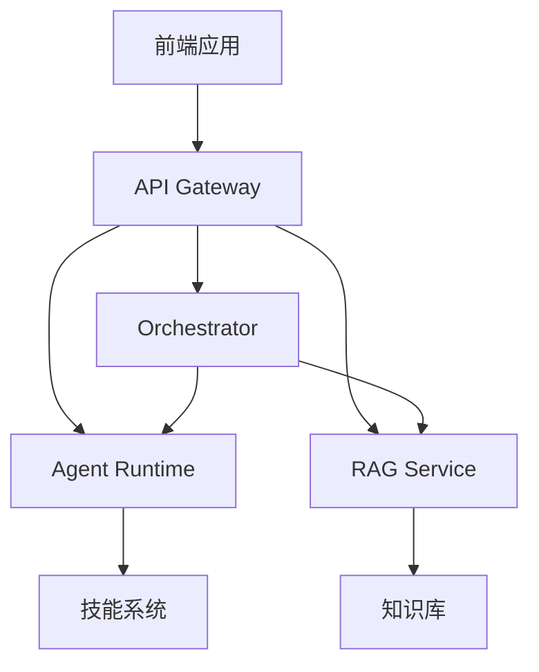
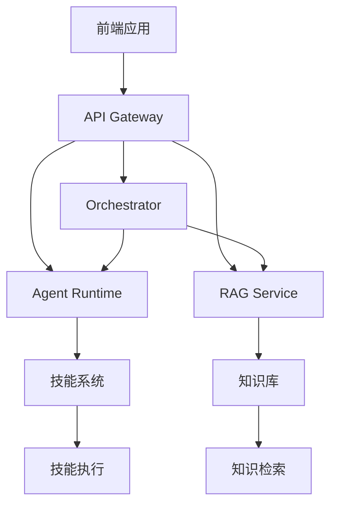
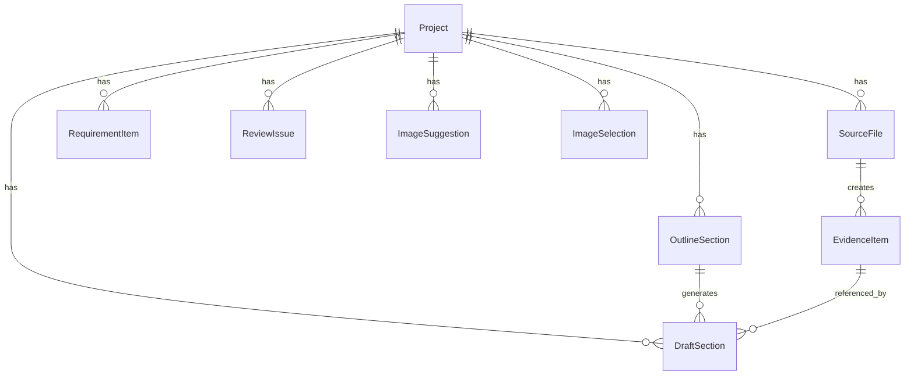

## 1. Architecture Design


## 2. Technology Description
- Frontend: React@18 + tailwindcss@3 + vite
- Initialization Tool: vite-init
- Backend: 现有后端服务（API Gateway, Orchestrator, Agent Runtime, RAG Service）
- Database: 现有数据库服务

## 3. Route Definitions
| Route | Purpose |
|-------|---------|
| / | 项目管理页 |
| /projects/new | 创建项目页 |
| /projects/[id] | 项目详情页 |
| /projects/[id]/upload | 资料上传页 |
| /projects/[id]/requirements | 需求解析结果页 |
| /projects/[id]/outline | 大纲规划页 |
| /projects/[id]/drafts | 内容撰写页 |
| /projects/[id]/images | 图片选择页 |
| /projects/[id]/final | 终稿预览页 |
| /skills | 技能系统展示页 |
| /flow | 流程测试页 |

## 4. API Definitions
### 4.1 项目管理 API
| Endpoint | Method | Description |
|----------|--------|-------------|
| /projects | GET | 获取项目列表 |
| /projects | POST | 创建新项目 |
| /projects/{id} | GET | 获取项目详情 |
| /projects/{id}/status | GET | 获取项目状态 |

### 4.2 资料上传 API
| Endpoint | Method | Description |
|----------|--------|-------------|
| /projects/{id}/upload | POST | 上传文件 |
| /projects/{id}/files | GET | 获取文件列表 |
| /projects/{id}/files/{fileId} | DELETE | 删除文件 |

### 4.3 需求解析 API
| Endpoint | Method | Description |
|----------|--------|-------------|
| /projects/{id}/requirements | GET | 获取需求解析结果 |

### 4.4 大纲规划 API
| Endpoint | Method | Description |
|----------|--------|-------------|
| /projects/{id}/outline | GET | 获取大纲 |
| /projects/{id}/outline/confirm | POST | 确认大纲 |
| /projects/{id}/outline/confirm-section/{sectionId} | POST | 确认单个章节 |

### 4.5 内容撰写 API
| Endpoint | Method | Description |
|----------|--------|-------------|
| /projects/{id}/drafts | GET | 获取草稿 |
| /projects/{id}/review | GET | 获取审查结果 |

### 4.6 图片选择 API
| Endpoint | Method | Description |
|----------|--------|-------------|
| /projects/{id}/image-suggestions | GET | 获取图片建议 |
| /projects/{id}/image-selections | POST | 保存图片选择 |

### 4.7 终稿 API
| Endpoint | Method | Description |
|----------|--------|-------------|
| /projects/{id}/final-html | GET | 获取最终HTML |
| /projects/{id}/final-pdf | GET | 获取最终PDF |

### 4.8 技能系统 API
| Endpoint | Method | Description |
|----------|--------|-------------|
| /internal/skills | GET | 获取技能列表 |
| /internal/skills/recommend | POST | 获取技能推荐 |
| /internal/skills/execute/{skillName} | POST | 执行技能 |

## 5. Server Architecture Diagram


## 6. Data Model
### 6.1 Data Model Definition


### 6.2 Data Definition Language
```sql
-- 项目表
CREATE TABLE projects (
  id UUID PRIMARY KEY,
  name VARCHAR(255) NOT NULL,
  description TEXT,
  created_at TIMESTAMP NOT NULL DEFAULT NOW(),
  updated_at TIMESTAMP NOT NULL DEFAULT NOW()
);

-- 源文件表
CREATE TABLE source_files (
  id UUID PRIMARY KEY,
  project_id UUID REFERENCES projects(id),
  file_name VARCHAR(255) NOT NULL,
  file_type VARCHAR(50) NOT NULL,
  object_key VARCHAR(255) NOT NULL,
  mime_type VARCHAR(255),
  parse_status VARCHAR(50) NOT NULL DEFAULT 'uploaded',
  created_at TIMESTAMP NOT NULL DEFAULT NOW()
);

-- 需求项表
CREATE TABLE requirement_items (
  id UUID PRIMARY KEY,
  project_id UUID REFERENCES projects(id),
  category VARCHAR(50) NOT NULL,
  source_text TEXT NOT NULL,
  normalized_text TEXT NOT NULL,
  mandatory BOOLEAN NOT NULL DEFAULT false,
  risk_level VARCHAR(50) NOT NULL DEFAULT 'medium'
);

-- 大纲章节表
CREATE TABLE outline_sections (
  id UUID PRIMARY KEY,
  project_id UUID REFERENCES projects(id),
  code VARCHAR(50) NOT NULL,
  title VARCHAR(255) NOT NULL,
  goal TEXT NOT NULL,
  evidence_requirements TEXT[],
  status VARCHAR(50) NOT NULL DEFAULT 'planned',
  confirmed BOOLEAN NOT NULL DEFAULT false
);

-- 草稿章节表
CREATE TABLE draft_sections (
  id UUID PRIMARY KEY,
  project_id UUID REFERENCES projects(id),
  outline_section_id UUID REFERENCES outline_sections(id),
  title VARCHAR(255) NOT NULL,
  content TEXT NOT NULL,
  evidence_ids UUID[],
  missing_inputs TEXT[]
);

-- 审查问题表
CREATE TABLE review_issues (
  id UUID PRIMARY KEY,
  project_id UUID REFERENCES projects(id),
  issue_type VARCHAR(50) NOT NULL,
  severity VARCHAR(50) NOT NULL,
  section_title VARCHAR(255) NOT NULL,
  message TEXT NOT NULL,
  suggested_action TEXT NOT NULL
);

-- 图片建议表
CREATE TABLE image_suggestions (
  id UUID PRIMARY KEY,
  project_id UUID REFERENCES projects(id),
  source_file_id UUID REFERENCES source_files(id),
  suggested_section_title VARCHAR(255) NOT NULL,
  usage_label VARCHAR(255) NOT NULL,
  placement VARCHAR(255) NOT NULL,
  caption TEXT NOT NULL,
  preview_url TEXT
);

-- 图片选择表
CREATE TABLE image_selections (
  id UUID PRIMARY KEY,
  project_id UUID REFERENCES projects(id),
  suggestion_id UUID REFERENCES image_suggestions(id),
  accepted BOOLEAN NOT NULL DEFAULT false,
  placement VARCHAR(255),
  layout VARCHAR(255)
);

-- 证据项表
CREATE TABLE evidence_items (
  id UUID PRIMARY KEY,
  project_id UUID REFERENCES projects(id),
  source_file_id UUID REFERENCES source_files(id),
  section_hint VARCHAR(255) NOT NULL,
  content TEXT NOT NULL,
  source_name VARCHAR(255) NOT NULL,
  location_hint VARCHAR(255) NOT NULL,
  confidence FLOAT NOT NULL DEFAULT 0.7
);
```